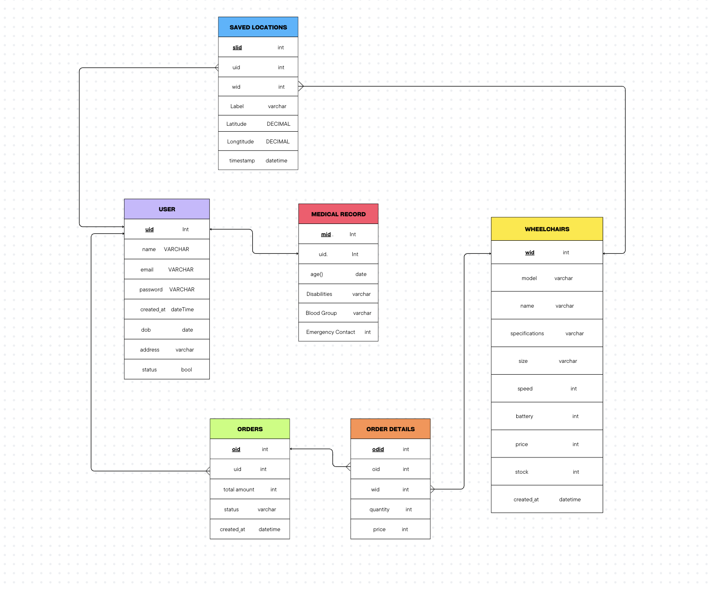

# This is the api server code
    This uses nodes js for mysql and express for apis 
 

# Installation steps

    -  Install nodejs first
    -  Clone this repo  (remember the branch "server")
 

    -  run " npm install "
 

    -  run  " node server.js "

  

# Database Schema

